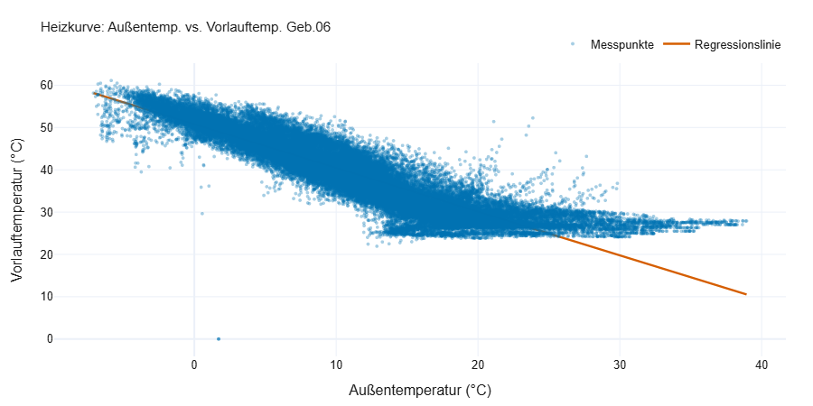
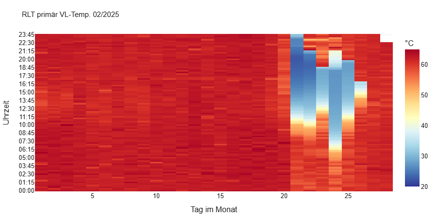
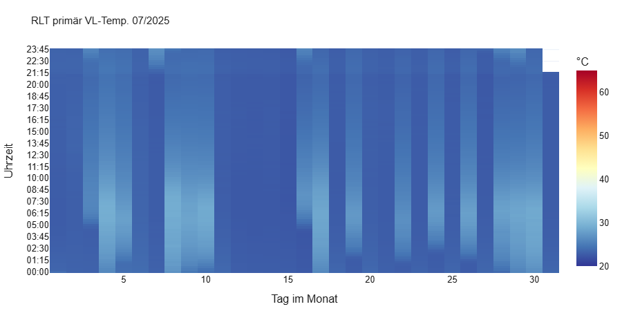

# Anleitung: KI-Agent Technisches Monitoring

Diese Anleitung erklärt in wenigen Schritten, wie ihr mit dem Tool Messdaten aus dem Technischen Monitoring prüft, auswertet und als Bericht ausgebt. Ihr braucht dafür keine Programmierkenntnisse.

## 1. Wofür ist das Tool gedacht?

Beim Technischen Monitoring von Nichtwohngebäuden fallen immer wiederkehrende Arbeiten an: Daten prüfen, Diagramme erstellen, Auffälligkeiten beschreiben und einen Bericht schreiben. Das Tool übernimmt diese Arbeiten automatisch aus einer Excel-Datei mit Messdaten.

**Was ihr bekommt:**

- eine **Datenprüfung** aller Messspalten (plausibel oder auffällig, mit Begründung),
- den **Messdatenkopf** (Abbildung 1) und **14 weitere Abbildungen** (Verläufe, Heizkurve, Carpetplots, Zonenvergleich je Systemtyp, Spreizung, Tagesverbräuche, Pumpenlaufzeiten, Datenverfügbarkeit, Dauerlinie); die Nummerierung entspricht der Hausarbeit mit agentenseitigen Ergänzungen,
- **Auswertungstexte**, deren Zahlen live aus euren Daten berechnet werden,
- eine Abschätzung des **Energieeinsparpotenzials** und eine **Bewertung** aller Befunde nach Schweregrad mit Empfehlungen,
- **Kontrollkriterien** für jeden Zwischenschritt mit automatischer Prüfung und einen **Entwurf für Kapitel 8** (Vergleich mit der manuellen Auswertung),
- einen **Word-Bericht** und eine **Excel-Arbeitsmappe** zum Weiterverwenden.

**Wichtig zum Einordnen:** Das Tool ersetzt keine fachliche Bewertung. Es liefert belastbare Zahlen und Hinweise. Ob eine Auffälligkeit ein Fehler ist, beurteilt ihr mit Kenntnis der Anlage.

## 2. Schnellstart in 3 Minuten

1. Öffnet die App (Link von der Projektgruppe).
2. In der linken Seitenleiste ist bereits der **Beispieldatensatz** (Messdaten 2024–2026) ausgewählt. Wartet etwa 20 Sekunden, bis oben vier Kennzahlen erscheinen.
3. Öffnet den Tab **🔍 Datenprüfung**. Wählt „Nur Auffällige“, um die Problemspalten zu sehen.
4. Öffnet **📈 Abbildungen** und scrollt durch die Diagramme. Unter jedem Diagramm steht, was es zeigt.
5. Öffnet **🧠 Auswertung** für die Texte und das Einsparpotenzial.
6. Öffnet **⬇️ Export** und klickt auf „Word-Bericht erzeugen“. Nach etwa 30 Sekunden erscheint der Download-Knopf.

Damit habt ihr einmal den kompletten Ablauf durchgespielt.

## 3. Eigene Messdaten verwenden

### 3.1 Datei hochladen

Klickt in der Seitenleiste unter **Eingabedaten** auf „Upload“ und wählt eure `.xlsx`-Datei (bis 200 MB). Sobald eine Datei hochgeladen ist, wird sie statt des Beispieldatensatzes verwendet. Das Einlesen dauert bei rund 58.000 Zeilen etwa 10 bis 15 Sekunden.

### 3.2 Erforderliches Dateiformat

Das Tool erwartet das Layout der Monitoring-Exporte, wie es der Beispieldatensatz zeigt:

| Anforderung | Wert |
|---|---|
| Blattname | `Tabelle1` |
| Kopfzeile mit den Spaltennamen | Zeile 7 (darüber stehen Kennzeilen wie Einheit, Min, Max) |
| Datenbeginn | Zeile 8 |
| Erste Spalte | `Datum` im Format `2024.11.01 00:00:00` |
| Zeitraster | 15 Minuten |
| Messspalten | genau die 23 Spalten aus der Tabelle unten, mit exakt diesen Namen |

**Die erwarteten Spaltennamen:**

| Nr. | Spaltenname in Excel | Einheit |
|---|---|---|
| 1 | `Zähler 019 - WMZ\ (M-Bus DSN 2) (M-Bus DSN 2) - Energie (Momentanwert)` | kWh |
| 2 | `RLT primär\VL Temp.` | °C |
| 3 | `RLT primär\RL Temp.` | °C |
| 4 | `statische Heizung -Lager (Geb.2)\VL Temp.` | °C |
| 5 | `statische Heizung -Lager(Geb.2)\RL Temp.` | °C |
| 6 | `statische Heizung -Gebäude 1 (Geb.3)\VL Temp.` | °C |
| 7 | `statische Heizung -Gebäude 1 (Geb.3)\RL Temp.` | °C |
| 8 | `Anlage KL01 - RLT02/03.01\AUL Temp.` | °C |
| 9 | `Anlage KL01 - RLT02/03.01\ZUL Temp.` | °C |
| 10 | `Zähler 021 - Strom RLT02/03 Abluftventilator\Energie (M-Bus DSN 1)` | kWh |
| 11 | `Zähler 022 - Strom RLT02/03 Zuluftventilator\Energie (M-Bus DSN 1)` | kWh |
| 12 | `statische Heizflächen Geb.06\VL Temp.` | °C |
| 13 | `statische Heizflächen Geb.06\RL Temp.` | °C |
| 14 | `Fußbodenheizung Geb.06\VL Temp.` | °C |
| 15 | `Fußbodenheizung Geb.06\RL Temp.` | °C |
| 16 | `statische Heizflächen Geb.06\HK Pumpe Betrieb` | 0/1 |
| 17 | `Fußbodenheizung Geb.06\HK Pumpe Betrieb` | 0/1 |
| 18 | `VL-Sollwert Fußbodenheizung` | °C |
| 19 | `VL-Sollwert Stat Heizfläche` | °C |
| 20 | `FBH Geb.08 KI-Räume\VL Temp.` | °C |
| 21 | `FBH Geb.08 KI-Räume\RL Temp.` | °C |
| 22 | `FBH Geb.08 Intensivpflege\VL Temp.` | °C |
| 23 | `FBH Geb.08 Intensivpflege\RL Temp.` | °C |

**Was passiert bei einem Fehler?** Fehlt eine Spalte, zeigt die App eine rote Meldung mit den fehlenden Namen an. Dann stimmt das Layout nicht mit dem erwarteten überein.

**Andere Anlagen oder Spalten?** Die Zuordnung der Spalten steht in der Datei `monitoring_agent/config.py`. Wer ein anderes Layout verwenden will, passt dort die Spaltenliste an (siehe Abschnitt 9).

### 3.3 Datenschutz

In der öffentlichen Cloud-Version werden hochgeladene Dateien auf dem Server der Streamlit-Cloud verarbeitet. Ladet dort **keine vertraulichen Betriebsdaten** hoch. Für solche Daten startet ihr die App lokal (Abschnitt 9).

## 4. Die Oberfläche im Überblick

### 4.1 Seitenleiste (links)

| Bereich | Wozu |
|---|---|
| **Eingabedaten** | Datei hochladen oder den Beispieldatensatz nutzen |
| **📅 Carpetplot-Zeitfenster** | Zeitfenster für die beiden Carpetplots (Abbildung 5 und 6): vier einzeln anklickbare Optionen Jahr, Monat, Woche oder Tag, je nach Wahl mit Jahr-Feld und Monats-Dropdown oder einem Datumsfeld (siehe 6.3) |
| **Darstellung Zeitreihen** | Auflösung der Liniendiagramme: Rohdaten (15 Min.), Stundenmittel oder Tagesmittel |
| **⚙️ Einstellungen – Funktionen an/aus** | Einzelne Funktionen ein- oder ausschalten (Abschnitt 5) |
| **🎚️ Schwellenwerte & Annahmen** | Grenzwerte und Annahmen per Regler ändern (Abschnitt 5) |

Die Auflösung der Liniendiagramme betrifft nur die **Anzeige**. Datenprüfung, Carpetplots und Tagesverbräuche rechnen immer mit den Rohdaten, damit kurze Aussetzer nicht weggeglättet werden.

### 4.2 Kennzahlen oben

Zeitraum, Anzahl der Messpunkte, Zahl der plausiblen und der auffälligen Spalten. Darunter klappt sich bei Bedarf **⏱️ Laufzeit des Agenten** auf.

### 4.3 Die Tabs

| Tab | Inhalt |
|---|---|
| **🔍 Datenprüfung** | Tabelle 1: jede Spalte mit Min, Max, Fehlwerten, Status und Begründung. Darunter der Messdatenkopf (Abbildung 1), die Datenabdeckung der Heiz- und Sommerperioden und die Auswahl, ob erkannte fehlerhafte Werte in die Auswertung einfließen (siehe 6.12) |
| **📈 Abbildungen** | Alle Diagramme (Abbildung 2 bis 16) mit Erklärung und der passenden Auswertung darunter |
| **🧠 Auswertung** | Die Auswertungstexte, darunter die Tabelle der nicht berücksichtigten Werte mit Begründung, dazu das Energieeinsparpotenzial mit Erläuterung |
| **🏢 Gebäude** | Netzplan der Heizungsanlage (Vorlauf/Rücklauf, Pumpen, Sollwerte, Zähler, laienverständlich beschriftet); Gebäude anklicken, Heizkreis wählen: eigene Datenprüfung, Kennzahlen und Diagramme nur für diesen Kreis (siehe 6.13) |
| **🏁 Bewertung** | Alle Befunde nach Schweregrad eingestuft, mit Regel, Kennzahl und Empfehlung (Kap. 6.5), dazu Zusammenfassung und Empfehlungen (Kap. 6.6) |
| **⚖️ Vergleich** | Gegenüberstellung mit der manuellen Auswertung und der Entwurf für Kapitel 8 je Zwischenschritt |
| **🧭 Vorgehen** | Zwischenschritte, Kontrollkriterien mit automatischer Prüfung, Aufbau des KI-Agenten, Sensorik-Übersicht, Diagrammtypen |
| **🎓 Forschung** | Antwortentwürfe zu den Forschungsfragen (Kap. 9), Theorie-Praxis-Abgleich, Empfehlungen und Ausblick (Kap. 10) |
| **🔎 Explorer** | Eigene Diagramme frei zusammenstellen |
| **⬇️ Export** | Word-Bericht, Kapitel-8-Entwurf und Excel-Arbeitsmappe erzeugen |
| **🗺️ Funktionsweise** | Ablaufpläne: wie Claude Code gearbeitet hat, wie das Tool aufgebaut ist und wo Subagenten eingesetzt wurden (keine) |
| **📖 Anleitung** | Diese Anleitung |

Die Tabs Bewertung, Vergleich, Vorgehen, Forschung und Explorer erscheinen nur, wenn die zugehörige Funktion eingeschaltet ist.

## 5. Einstellungen

### 5.1 Funktionen an- und ausschalten

Unter **⚙️ Einstellungen – Funktionen an/aus** steht für jede Funktion ein Schalter. Standardmäßig sind alle eingeschaltet, außer der LLM-Auswertung und den erweiterten Prüfregeln (v2). Das Ausschalten blendet nur die Ansicht aus; die Kontrollkriterien rechnen weiter.

| Schalter | Wirkung |
|---|---|
| **Laufzeitmessung** | Zeigt, wie lange jeder Schritt dauert, und berechnet den Faktor gegenüber eurem manuellen Aufwand |
| **Anomalien in Diagrammen markieren** | Rote Rauten bei Nullwert-Aussetzern, Zählerrücksprüngen und zu geringer Spreizung |
| **Vergleichsansicht (Kap. 8)** | Blendet den Tab „Vergleich“ ein |
| **LLM-Auswertung (Claude)** | Ein Sprachmodell formuliert die Auswertung. Benötigt einen Anthropic-API-Key (siehe 6.7) |
| **Erweiterte Prüfregeln (v2)** | Zusätzliche, strengere Prüfregeln in der Datenprüfung |
| **Energieeinsparpotenzial** | Zeigt die Abschätzung im Tab „Auswertung“ und im Word-Bericht |
| **Bewertung (Kap. 6.5)** | Blendet den Tab „Bewertung“ ein und nimmt die Bewertung in den Word-Bericht auf |
| **Vorgehen und Kontrollkriterien (Kap. 4/5)** | Blendet den Tab „Vorgehen“ ein |
| **Forschungsfragen (Kap. 9/10)** | Blendet den Tab „Forschung“ ein |
| **Explorer (freie Diagramme)** | Blendet den Tab „Explorer“ ein |
| **Gebäude & Heizkreise** | Blendet den Tab „Gebäude“ ein (siehe 6.13) |
| **Word-Berichtsexport** | Schaltet den Word-Export im Tab „Export“ frei |

### 5.2 Schwellenwerte und Annahmen

Unter **🎚️ Schwellenwerte & Annahmen** stellt ihr ein, wie die Auswertung rechnet:

| Regler | Bedeutung | Standard |
|---|---|---|
| Heizgrenze Außentemperatur | Ab dieser Tagesmitteltemperatur sollte nicht mehr geheizt werden | 15 °C |
| Aktiver Heizbetrieb ab Vorlauf | Ab dieser Vorlauftemperatur gilt ein Kreis als „in Betrieb“ | 25 °C |
| Mindest-Spreizung Delta T | Darunter gilt die Spreizung zwischen Vor- und Rücklauf als zu gering | 2 K |
| FBH-Auslegungsgrenze Vorlauf | Übliche Obergrenze für Fußbodenheizungen; erscheint als rote Grenzlinie in den Vorlauf-Diagrammen von FBH-Kreisen | 40 °C |
| Heizkörper-Auslegungsgrenze Vorlauf | Zulässige Vorlauftemperatur für Heizkörper/statische Heizflächen; erscheint als rote Grenzlinie in deren Vorlauf-Diagrammen | 70 °C |
| Vermeidbarer Wärmeanteil oberhalb Heizgrenze | Anteil des Wärmeverbrauchs an warmen Tagen, der sich vermeiden ließe | 50 % |
| RLT-Nachtabsenkung (Stunden/Nacht) | Länge der Absenkung der Lüftung | 8 h |
| Ventilatorstrom-Reduktion in der Nacht | Um wie viel der Ventilatorstrom in dieser Zeit sinkt | 50 % |
| Wärmepreis, Strompreis | Für die Kostenrechnung | 0,09 und 0,30 €/kWh |

Die Regler wirken sofort auf Texte, Marker, Datenprüfung und Einsparpotenzial.

## 6. Beispiel-Anwendungen

Die Zahlen in den Beispielen stammen aus dem mitgelieferten Datensatz.

### 6.1 Beispiel: Die Datenqualität prüfen

**Ziel:** Herausfinden, welchen Messdaten ihr nicht trauen könnt.

1. Tab **🔍 Datenprüfung** öffnen und „Nur Auffällige“ wählen.
2. Ihr seht 14 Spalten. Lest die Spalte **Bewertung**, dort steht der Grund. Beispiele: „Min-Wert 0 in 3 Zeitschritt(en) deutet auf Aussetzer der Datenaufzeichnung hin“ oder „3 rückläufige Zählerstände (Reset/Übertragungsfehler)“.
3. Öffnet **📈 Abbildungen** und geht zur letzten Abbildung **Datenverfügbarkeit je Sensor und Tag**. Ein senkrechter Strich durch viele Sensoren bedeutet einen gemeinsamen Ausfall der Datenerfassung. Im Beispiel liegt er am 26.10.2025 und betrifft 22 Sensoren. Das ist der Tag der Zeitumstellung, eine mögliche Ursache, die ihr beim Betreiber prüfen könnt.
4. Schaltet unter Einstellungen **Anomalien in Diagrammen markieren** ein und seht euch die Regelgüte-Diagramme an. Die roten Rauten zeigen die Aussetzer.

**Ergebnis:** Ihr wisst, welche Spalten ihr in der weiteren Auswertung vorsichtig behandeln müsst.

### 6.2 Beispiel: Eine falsch eingestellte Heizkurve erkennen

**Ziel:** Prüfen, ob die Heizung bei warmem Wetter unnötig weiterläuft.

1. Tab **📈 Abbildungen**, Diagramm **Heizkurve: Außentemp. vs. Vorlauftemp. Geb.06**.
2. Jeder Punkt ist ein Messzeitpunkt, die orange Linie ist die Regressionsgerade. Bei einer sinnvollen Heizkurve sollten die Punkte oberhalb der Heizgrenze auf niedrigem Niveau abbrechen.



3. Die Punkte bleiben aber bei rund 25 bis 30 °C Vorlauf, auch bei 20 °C und mehr Außentemperatur. Der Text darunter fasst das zusammen: In 96 % der Zeitschritte oberhalb von 15 °C Außentemperatur liegt der Vorlauf weiter über 25 °C (Mittelwert 29,6 °C).
4. **Selbst ausprobieren:** Stellt in **🎚️ Schwellenwerte & Annahmen** die Heizgrenze auf 12 °C. Der Text wird neu berechnet: Es sind dann 97 % der Zeitschritte mit einem Mittelwert von 31,4 °C. Der Befund bleibt, unabhängig von der gewählten Grenze.

**Ergebnis:** Die Regelung hat keine wirksame Heizgrenze. Das ist ein konkreter Ansatzpunkt für die Optimierung.

### 6.3 Beispiel: Sommer und Winter im Carpetplot vergleichen, bis auf den einzelnen Messpunkt zoomen

**Ziel:** Betriebszustände einer Anlage über den Tag, die Woche, den Monat oder das Jahr erkennen, ohne an Genauigkeit zu verlieren.

Ein Carpetplot zeigt einen Messwert als Farbfläche. Jede Zelle ist immer **ein einzelner 15-Minuten-Messwert**, egal welches Zeitfenster ihr wählt – es wird nichts geglättet oder gemittelt, sondern nur mehr oder weniger davon auf einmal gezeigt. Die Farbskala ist fest auf 20 bis 65 °C gesetzt, damit ihr mehrere Zeiträume vergleichen könnt.

1. Öffnet die Seitenleiste **📅 Carpetplot-Zeitfenster**. Unter „Ansicht“ steht jede Option einzeln zum Anklicken da (kein verstecktes Dropdown):
   - **Monat** (Standard, wie im Beispielbild): waagerecht der Tag im Monat, senkrecht die Uhrzeit. Der Monat wird über ein Dropdown mit Monatsnamen gewählt (Jahr separat als Zahl).
   - **Jahr**: waagerecht jeder Tag des Jahres (bis zu 365 Spalten) – der schnellste Überblick über die ganze Heizperiode auf einen Blick.
   - **Woche**: waagerecht die 7 Wochentage, mit großen, gut lesbaren Zellen.
   - **Tag**: ein waagerechter Streifen über 24 Stunden – die feinste Zoomstufe, jeder der 96 Viertelstundenwerte einzeln sichtbar.
   Bei „Woche“ und „Tag“ genügt ein einzelnes Datum (bei „Woche“ reicht ein beliebiger Tag in der gewünschten Woche). Im Tab **📈 Abbildungen** steht oben immer ein Hinweiskasten mit dem gerade aktiven Zeitfenster.
2. Wählt Jahr 2025, Monat Februar: Der Februar ist fast durchgehend rot, das Tagesmittel liegt an allen Tagen bei rund 62 °C. Auffällig ist eine blaue Phase zwischen dem 21. und 25. Februar, in der das Tagesmittel auf 41 bis 51 °C einbricht. Das ist ein Ereignis, das ihr mit dem Betreiber klären solltet.


3. In jeder Zelle von Abbildung 5 (RLT primär VL) steht zusätzlich klein die **Außentemperatur zur selben Uhrzeit** (aus „RLT KL01 Außenluft“, auf eine Nachkommastelle genau wie im Tooltip, nicht auf ganze Grad gerundet). So seht ihr direkt, ob der Vorlauf bei kalter Außentemperatur mitzieht – bei „Woche“ und „Tag“ sind die Zellen groß genug, um die Zahl gut zu lesen; bei „Jahr“ entfällt sie wegen der vielen Zellen. Abbildung 6 (Rücklauf) zeigt keine Außentemperatur, weil hier der Zusammenhang zum Vorlauf im Vordergrund steht.
4. Vergleicht mit dem Juli. Am schnellsten geht das im Tab **🔎 Explorer**: Diagrammtyp „Carpetplot“, Spalte „RLT primär VL“, Zeitfenster „Monat“, Jahr 2025, Monat Juli. Dort lässt sich zusätzlich das Häkchen „Außentemperatur in jeder Zelle anzeigen“ abwählen, wenn die Zahlen stören.



Im Juli liegt die Vorlauftemperatur bei etwa 22 bis 29 °C, also nahe der Raumtemperatur. Das Heizregister wird dann vermutlich nicht mit Heizwasser versorgt. Im Februar ist außerhalb der Störphase kein Tag-Nacht-Unterschied zu sehen, eine Nachtabsenkung fehlt. Um das für einen einzelnen Tag zu bestätigen, stellt das Zeitfenster auf „Tag“ und wählt z. B. den 10. Februar: Ihr seht alle 96 Messpunkte dieses Tages nebeneinander, mit Außentemperatur in jeder Zelle.

5. **Zum besseren Einschätzen der Werte** hat jeder Carpetplot zwei Schaltflächen-Paare direkt über dem Diagramm (Teil des Plotly-Diagramms selbst, kein Streamlit-Neuladen nötig):
   - **🌓 Tag/Nacht ein/aus**: blendet die Nachtstunden (22–6 Uhr, eine übliche Annahme für Nachtabsenkung) ein oder aus – als abgedunkelte Fläche mit zwei kräftigen gelb gestrichelten Grenzlinien an Nachtbeginn und -ende, gut erkennbar unabhängig von der jeweiligen Heatmap-Farbe darunter. So seht ihr auf einen Blick, ob eine auffällige Farbe nachts oder tagsüber liegt, ohne jede Zeile einzeln ablesen zu müssen.
   - **🎨 Betriebszustände ein/aus**: blendet eine Legende unter dem Diagramm ein oder aus, die die Farbskala in Worte übersetzt – z. B. „Aus (< 27 °C)“, „Nachtabsenkung (27–38 °C)“, „Normalbetrieb (38–58 °C)“, „Volllast (> 58 °C)“. Die Farbe jedes Punkts in der Legende entspricht der Farbe an der jeweiligen Stelle der Farbskala, sodass auch ohne Heizungstechnik-Kenntnisse sofort erkennbar ist, wie ausgelastet die Anlage gerade ist.
   Beide Paare lassen sich unabhängig voneinander und je Diagramm einzeln ein- oder ausblenden. **Wichtig:** Die vier Begriffe und ihre Grenzen (15 %/40 %/85 % der Farbskala) sind eine beispielhafte, grobe Einteilung zur Orientierung – keine Herstellerangabe und keine feste Regel. Wollt ihr andere Grenzen oder Begriffe, ändert `OPERATING_BANDS` in `monitoring_agent/figures.py`.

Dieselbe Auflösung und dieselben Overlays gibt es auch im Tab **🏢 Gebäude** für den Carpetplot jedes einzelnen Heizkreises (siehe 6.13).

**Tipp:** Im Explorer könnt ihr die Farbskala per Regler verschieben, um kleine Unterschiede sichtbar zu machen.

### 6.4 Beispiel: Das Einsparpotenzial durchspielen

**Ziel:** Prüfen, welche Maßnahmen das Einsparziel von 10 % erreichbar machen.

1. Tab **🧠 Auswertung**, nach unten zu **💡 Energieeinsparpotenzial** scrollen.
2. Mit den Standardannahmen ergeben sich **6.854 kWh pro Jahr** und **1.923 €**. Das sind **7,1 %** des gemessenen Verbrauchs, also 2,9 Prozentpunkte unter dem Ziel.
3. Öffnet **🎚️ Schwellenwerte & Annahmen** und probiert aus:

| Annahme | Einsparung | Anteil |
|---|---|---|
| Standard (8 h Nachtabsenkung, 50 % Reduktion, 50 % vermeidbare Wärme) | 6.854 kWh/a | 7,1 % |
| 12 h Nachtabsenkung, 70 % Reduktion | 13.697 kWh/a | 14,2 % |
| 10 h, 60 % Reduktion und 80 % vermeidbare Wärme | 10.343 kWh/a | 10,7 % |

4. Die Erläuterungen darunter (Maßnahme 1, Maßnahme 2, Gesamteinordnung) passen sich an.

**Ergebnis:** Fast das gesamte Potenzial liegt in der RLT-Nachtabsenkung. Die Annahmen sind aber nur Schätzungen. Nennt sie in eurer Arbeit ausdrücklich als Annahmen.

### 6.5 Beispiel: Einen Bericht für die Abgabe erzeugen

1. Prüft, dass in den Einstellungen die gewünschten Funktionen eingeschaltet sind. Der Word-Bericht enthält nur, was eingeschaltet ist (z. B. das Einsparpotenzial).
2. Tab **⬇️ Export**, Knopf **Word-Bericht erzeugen**. Das Rendern der Abbildungen dauert etwa 30 Sekunden.
3. Auf **monitoring_bericht.docx** klicken.

**HTML-Bericht zum Verschicken:** Im Tab **⬇️ Export** erzeugt **HTML-Bericht erzeugen** eine einzige Datei mit demselben Inhalt wie der Word-Bericht. Sie öffnet sich per Doppelklick in jedem Browser, ohne Python und ohne Internet, und die Diagramme bleiben interaktiv. Das ist der einfachste Weg, Ergebnisse an Betreuer zu schicken.

**Aufbau des Berichts** (in Anlehnung an Kapitel 6 der Hausarbeit): 1 Einleitung und Datengrundlage, 2 Datenprüfung (mit Messdatenkopf als Abbildung 1), 3 Grafische Aufbereitung und Auswertung (jeder Text steht direkt unter seiner Abbildung, Nummerierung wie in der Arbeit), 4 Energieeinsparpotenzial, 5 Bewertung der Ergebnisse, 6 Zusammenfassung und Empfehlungen (mit Theorie-Praxis-Abgleich), 7 Vergleich mit der manuellen Auswertung.

Wenn statt der Diagramme der Hinweis „Abbildung konnte nicht gerendert werden“ steht, fehlt dem Server ein Browser für das Bildrendern (siehe 8). Die **Excel-Arbeitsmappe** ist die Alternative: Sie enthält die Datenprüfung und alle Diagramme als bearbeitbare Excel-Diagramme.

### 6.6 Beispiel: Manuelle Auswertung und Agent vergleichen

Dieser Ablauf ist für Studienarbeiten gedacht, in denen eine manuelle Auswertung als Referenz dient.

1. Legt eure manuelle Auswertung in den Dateien `reference/manual_tabelle1.csv` (Status je Spalte) und `reference/manual_findings.csv` (fachliche Befunde) ab. Beide Dateien sind Textdateien mit Semikolon als Trennzeichen. Die mitgelieferten Dateien zeigen das Format: `manual_tabelle1.csv` hat die Spalten `Spalte;Manuell;Manueller_Befund` (Manuell ist `Plausibel` oder `Auffällig`), `manual_findings.csv` die Spalten `Kontrollkriterium;Manueller_Befund_Kap_6_4;Agent_Block`.
2. Öffnet **⚖️ Vergleich**. Ihr seht die Übereinstimmung, in der Beispielauswertung 13 von 23 Spalten (56 %).
3. Schaltet **Erweiterte Prüfregeln (v2)** ein und schaut in die Tabelle „Regelsatz v1 gegen v2“:

| Regelsatz | Trefferquote | Genauigkeit |
|---|---|---|
| v1 (Standard) | 70 % | 50 % |
| v2 (erweitert) | 100 % | 50 % |

Die Trefferquote gibt an, wie viele der manuell gefundenen Auffälligkeiten der Agent auch findet. Die Genauigkeit gibt an, wie viele der Agent-Auffälligkeiten auch manuell auffällig waren. Strengere Regeln finden mehr, melden aber auch mehr zusätzliche Fälle.

4. Tragt im Bereich **⏱️ Laufzeit des Agenten** ein, wie viele Stunden die manuelle Auswertung gedauert hat. Die App berechnet den Zeitfaktor.

### 6.7 Beispiel: Die Auswertung mit einem Sprachmodell formulieren lassen (optional)

Diese Funktion ist standardmäßig aus.

1. Schaltet **LLM-Auswertung (Claude)** ein und wählt ein Modell.
2. Tragt euren Anthropic-API-Key in das Feld ein. Er bleibt nur im Arbeitsspeicher dieser Sitzung.
3. Tab **🧠 Auswertung**, Knopf **Auswertung mit Claude erzeugen**.
4. In der Seitenleiste erscheint die Wahl **Regelbasiert / Claude (LLM)**. Sie bestimmt, welcher Text angezeigt und exportiert wird.

Das Sprachmodell erhält nur die im Tool berechneten Kennzahlen und darf keine Zahlen erfinden. Für die Cloud-Version hinterlegt der Betreiber den Key unter „Settings → Secrets“ als `ANTHROPIC_API_KEY`. Gebt den Key niemals weiter und schreibt ihn nie in eine Datei im Projekt.

### 6.8 Beispiel: Eigene Diagramme im Explorer

Im Tab **🔎 Explorer** stellt ihr Diagramme selbst zusammen:

- **Liniendiagramm:** mehrere Spalten mit gleicher Einheit wählen, Zeitraum und Auflösung einstellen. Bei verschiedenen Einheiten warnt die App, weil zwei Achsen schwer lesbar sind.
- **Streudiagramm:** eine Spalte gegen eine andere, z. B. Außentemperatur gegen einen Vorlauf.
- **Carpetplot:** beliebige Spalte, beliebiger Monat, Farbskala per Regler.

Beispiel: „RLT KL01 Außenluft“ und „RLT KL01 Zuluft“ im Januar 2026 mit Rohdaten (15 Min.) zeigen, wie stark die Lüftungsanlage die Außenluft aufheizt.

### 6.9 Beispiel: Kontrollkriterien prüfen und Kapitel 8 vorbereiten

Dieser Ablauf unterstützt den Vergleich der konventionellen Bearbeitung mit der KI-gestützten (Kapitel 5 bis 8 der Arbeit).

1. Öffnet den Tab **🧭 Vorgehen**. Ganz oben steht die Kapitel-Landkarte, darunter für jeden der fünf Zwischenschritte (Datenprüfung, Grafikerstellung, Auswertung, Bewertung, Berichtserstellung), wie viele Kontrollkriterien erfüllt sind. Im Beispiel sind es **16 von 18 bewertbaren Kriterien**.
2. Lest die Spalte **Art**: Nur 6 der Kriterien sind ein **Referenzvergleich** gegen euer manuelles Ergebnis (davon 4 erfüllt). Die übrigen 12 sind **Eigenprüfungen** (Vollständigkeit, Konfiguration, Anforderungen). Sie belegen nicht, dass der Agent inhaltlich dasselbe findet wie ihr. Formuliert das in der Arbeit ehrlich so.
3. Schaut euch die nicht erfüllten Kriterien an: **DP3** (Trefferquote 70 % bei 90 % Soll) und **DP4** (Genauigkeit 50 % bei 70 % Soll). Der Optimierungsvorschlag steht im Tab **⚖️ Vergleich** unter Kapitel 8. Schaltet zur Probe **Erweiterte Prüfregeln (v2)** ein: DP3 springt auf 100 % und es sind dann 17 von 18 Kriterien erfüllt.
4. Öffnet im Tab **⚖️ Vergleich** den Bereich **Kapitel 8: Vergleich je Zwischenschritt**. Für jeden Zwischenschritt gibt es die Gliederung der Arbeit: Gegenüberstellung, Vergleich, Optimierung, Diskussion, Zusammenfassung. **Die Diskussion schreibt ihr selbst** in das Textfeld.
5. Im Tab **⬇️ Export** erzeugt der Knopf **Kapitel-8-Entwurf erzeugen** ein Word-Dokument mit 8.1 bis 8.7. Eure Diskussionstexte sind darin enthalten; leere Diskussionen sind als „[Diskussion von den Bearbeitern zu ergänzen]“ markiert.

**Kriterien anpassen:** Die Kriterien und Grenzwerte stehen in `reference/kontrollkriterien.csv`. Sie sind Vorschläge und mit dem Betreuer abzustimmen. Ändert ihr dort einen Grenzwert, wirkt er nach dem Neuladen der App sofort. Die manuelle Bewertung aus Kapitel 6.5 tragt ihr in `reference/manual_bewertung.csv` ein (Spalten `Befund_Key;Manuell_Schweregrad;Manuelle_Empfehlung`). Danach wird das Kriterium **BW4** bewertbar.

### 6.10 Beispiel: Befunde bewerten und priorisieren

1. Tab **🏁 Bewertung** öffnen. Im Beispiel gibt es 8 Befunde: 2 mit hohem, 5 mit mittlerem und 1 mit geringem Schweregrad.
2. Klickt einen Befund auf, zum Beispiel „Heizkurve ohne erkennbare Heizgrenze“. Ihr seht die Kennzahl (96 % der Zeitschritte), die **Einstufungsregel** und die **Empfehlung**.
3. Die Regel ist überall gleich: Maßgeblich ist das **Maximum** aus der Häufigkeit (mittel ab 10 % der Zeit, hoch ab 50 %) und der energetischen Relevanz (mittel ab 1 % des Verbrauchs, hoch ab 5 %). Für sicherheits- oder bilanzrelevante Befunde gilt mindestens die Stufe „mittel“. Ein Beispiel dafür ist die Zone Intensivpflege.
4. Ganz unten steht die **Zusammenfassung und Empfehlungen** (Kap. 6.6). Sie nennt die Schwerpunkte und den Abstand zum 10-%-Ziel.

**Hinweis:** Die Einstufung ist ein Vorschlag nach offenen Regeln. Die Grenzen sind in `monitoring_agent/assessment.py` hinterlegt und lassen sich dort ändern.

### 6.11 Beispiel: Forschungsfragen und Theorie-Praxis-Abgleich

1. Tab **🎓 Forschung** öffnen. Oben stehen die Forschungsfragen aus `reference/forschungsfragen.csv`. **Es sind Entwürfe.** Stimmt sie mit dem Betreuer ab und ändert sie in der Datei.
2. Unter jeder Frage steht ein **Antwortentwurf mit Belegen**, zum Beispiel: „Der Agent erfüllt 16 von 18 bewertbaren Kontrollkriterien“ oder „Beziffert werden 6.854 kWh pro Jahr, das sind 7,1 %“. Schreibt eure eigene Antwort in das Textfeld darunter und übernehmt sie in die Arbeit. Die Eingabe bleibt nur in der laufenden Sitzung erhalten.
3. Für die Frage nach dem Zeitvorteil (FF2) tragt ihr zuerst den manuellen Aufwand im Bereich **⏱️ Laufzeit des Agenten** ein. Erst dann berechnet die App den Faktor.
4. Der **Theorie-Praxis-Abgleich** prüft sieben theoretische Aussagen aus eurer Arbeit gegen die Messdaten, zum Beispiel die Heizgrenze von 15 °C (nicht bestätigt, weil in 96 % der Zeit weiter geheizt wird) oder die Auslegung von Fußbodenheizungen als Niedertemperatursysteme (teilweise bestätigt, Abweichung in den KI-Räumen von Gebäude 08).
5. Darunter stehen Zusammenfassung, Empfehlungen und ein **Ausblick als Entwurf** für Kapitel 10.

### 6.12 Beispiel: Fehlerhafte Werte ausschließen

**Ziel:** Entscheiden, ob erkannte Fehlwerte in Diagrammen, Kennwerten und Bewertung mitzählen.

1. Tab **🔍 Datenprüfung**, ganz nach unten zum Abschnitt **Fehlerhafte Werte behandeln**. Im Beispiel meldet die Prüfung **40 eindeutig fehlerhafte Werte**: Nullwert-Aussetzer bei Vor-, Rücklauf und Sollwerten sowie Zähler-Rücksprünge.
2. Wählt die Behandlung:
   - **Alle Werte behalten (wie bisher)** ist die Voreinstellung. Nichts ändert sich.
   - **Nur ausgewählte Werte ausschließen** zeigt eine Tabelle mit einem Kästchen je Spalte und Fehlerart. Ihr seht Anzahl, Zeitraum und die Begründung. Setzt Haken bei den Werten, die nicht mitzählen sollen. Im Beispiel: die 16 Nullwerte der Stat. Heizung Geb.06 VL (Soll).
   - **Alle eindeutig fehlerhaften Werte ausschließen** wählt alle Nullwerte, Werte außerhalb des plausiblen Bereichs und Zähler-Rücksprünge auf einmal.
3. Die App rechnet sofort neu. Die ausgeschlossenen Werte fehlen in den Abbildungen und fließen nicht in Kennwerte, Auswertungstexte, Bewertung und Einsparpotenzial ein. Sie werden wie Fehlwerte behandelt. Die Tabelle der Datenprüfung zeigt weiterhin die unveränderten Rohdaten, und die Rohdatei wird nie verändert.
4. Tab **🧠 Auswertung**, Abschnitt **Nicht berücksichtigte Werte**: Die Tabelle nennt je Spalte und Fehlerart die Anzahl, den ersten und letzten Zeitpunkt und die Begründung. Unter **Einzelwerte anzeigen** steht jeder ausgeschlossene Wert mit Zeitpunkt und Messwert. Die Tabellen lassen sich sortieren, die Einzelwerte als CSV herunterladen. Excel-Arbeitsmappe und Word-Bericht enthalten dieselbe Übersicht.

**Sonderfall Rücklauf über Vorlauf:** In den Beispieldaten liegt der Rücklauf in sehr vielen Zeitschritten (94.338 Werte) über dem Vorlauf. Das kann ein echter Messwert sein, zum Beispiel wenn die Pumpe steht und die Leitung auskühlt. Diese Werte werden deshalb nie automatisch ausgeschlossen, sondern nur, wenn ihr sie in der Einzelauswahl ausdrücklich abhakt. Schaut vorher nach, wie viele Werte einer Spalte das betrifft: Bei „RLT primär VL“ sind es 36 % aller Zeitschritte.

**Ergebnis:** Ihr steuert selbst, welche Werte in die Auswertung eingehen, und könnt jede Entscheidung mit Begründung nachweisen.

### 6.13 Beispiel: Das Heizungskonzept verstehen und einen Heizkreis auswählen

**Ziel:** Auch ohne Heizungstechnik-Vorwissen verstehen, wie die Anlage aufgebaut ist, und nur einen bestimmten Heizkreis untersuchen statt immer den ganzen Datensatz.

Die Anlage besteht aus **7 eigenständigen Heizkreisen** (jeweils mit eigenem Vor- und Rücklauf) in 4 Gebäuden; ein Gebäude kann mehrere Heizkreise besitzen. Der feste Bericht in den übrigen Tabs zeigt immer den gesamten Datensatz (Kap. 6 der Arbeit). Der Tab **🏢 Gebäude** ergänzt eine zweite, unabhängige Sicht: zuerst den Netzplan der ganzen Anlage, danach wahlweise nur einen Heizkreis.

1. Tab **🏢 Gebäude** öffnen. Oben steht der **Netzplan**: Von der Wärmeerzeugung (oben, Kessel/Übergabe – selbst nicht in den Messdaten enthalten) geht es über den Wärmemengenzähler zu den 4 Gebäuden und von dort zu den 7 Heizkreisen. In jeder Kreis-Karte stehen:
   - eine **rote Linie** für den Vorlauf (warmes Wasser zum Verbraucher) und eine **blaue Linie** für den Rücklauf, jeweils mit einem Punkt für den Messwert,
   - darunter **grau-kursiv der genaue Spaltenname** aus der Messdaten-Tabelle, z. B. „FBH Geb.06 VL (Ist)“ – damit lässt sich jeder Punkt im Netzplan direkt in Tabelle 1 (Tab „Datenprüfung“) wiederfinden,
   - ein **Pumpensymbol** (Kreis mit Dreieck), wenn eine Umwälzpumpe gemessen wird,
   - eine **gestrichelte Markierung mit „Soll-Vorlauf“**, wenn zusätzlich ein Sollwert erfasst wird,
   - bei der RLT-Anlage zusätzlich Außenluft/Zuluft und die beiden Stromzähler der Ventilatoren.
   Die Legende unten im Netzplan erklärt alle Symbole noch einmal.
2. Darunter steht dieselbe Übersicht als Schaltflächen: eine Fläche je Heizkreis, zum Beispiel „4. Fußbodenheizung“ unter Gebäude 6. Anklicken wählt den Kreis aus; die passende Karte im Netzplan oben wird dick umrandet.
3. Nach der Auswahl erscheinen Kennzahlen (z. B. Vorlauf Min/Max, Delta T, Pumpen-Laufzeitanteil), eine Datenprüfung nur für die Spalten dieses Kreises sowie Diagramme, die sich aus den vorhandenen Messgrößen ergeben: Soll-Ist-Vergleich (wenn ein Sollwert vorhanden ist), Vorlauf und Rücklauf, Temperaturspreizung, Carpetplot und Pumpenlaufzeit (wenn eine Pumpe vorhanden ist). Der Carpetplot nutzt dasselbe Zeitfenster (Jahr/Monat/Woche/Tag) wie in der Seitenleiste unter „📅 Carpetplot-Zeitfenster“ eingestellt (siehe 6.3) und zeigt ebenfalls die Außentemperatur in jeder Zelle.
4. Ein erneuter Klick auf denselben Heizkreis oder **Auswahl aufheben** setzt die Auswahl zurück; die übrigen Tabs zeigen dann wieder den Gesamtbericht.

**Hinweis:** Diese Ansicht ergänzt den festen Bericht und verändert ihn nicht. Bereits ausgeschlossene Werte (6.12) sind auch hier schon nicht berücksichtigt. Welche Spalte zu welchem Gebäude und Heizkreis gehört, steht in `monitoring_agent/buildings.py`, das Aussehen des Netzplans in `monitoring_agent/building_diagram.py` – beides lässt sich dort anpassen, falls sich die Anlage ändert.

### 6.14 Beispiel: Geordnete Dauerlinie – wann braucht es ein Zusatzheizgerät?

**Ziel:** Abschätzen, wie oft die volle Heizleistung wirklich gebraucht wird, als Grundlage für die Auslegung eines Spitzenlast- oder Zusatzheizgeräts.

1. Tab **📈 Abbildungen**, ganz unten **Abbildung 16: Geordnete Dauerlinie der thermischen Leistung**. Die Leistung wird aus der Differenz zweier aufeinanderfolgender Zählerstände des Wärmemengenzählers geteilt durch die tatsächlich verstrichene Zeit berechnet (keine feste 15-Minuten-Annahme, damit Lücken im Datensatz die Kurve nicht verfälschen) und absteigend sortiert dargestellt.
2. Die x-Achse zeigt die Betriebsstunden, in denen eine Leistung erreicht oder überschritten wird – ganz links steht die Spitzenleistung, die nur sehr kurz anliegt, nach rechts hin sinkt die Kurve auf die meiste Zeit über gültige Grundlast.
3. Vier Referenzpunkte sind eingezeichnet (1 %, 5 %, 10 %, 20 % der Betriebsstunden) mit der jeweiligen Leistung. Ein Grundlastgerät, das auf einen dieser Werte ausgelegt ist, deckt die übrige Zeit allein ab; nur für die selteneren Spitzen oberhalb davon wäre ein Zusatz- bzw. Spitzenlastgerät nötig.
4. Die zugehörige Auswertung im Tab **🧠 Auswertung** nennt die konkreten Zahlen aus eurem Datensatz.

**Wichtig:** Die tatsächliche Leistung des vorhandenen Wärmeerzeugers steht nicht in den Messdaten. Die vier Referenzpunkte sind Vorschläge für mögliche Auslegungsgrenzen, keine Aussage darüber, welches Gerät tatsächlich verbaut ist oder sein sollte – das ist mit der Anlagendokumentation bzw. dem Betreiber abzugleichen.

### 6.15 Beispiel: Erkennen, wenn eine Komponente zu heiß angefahren wird

**Ziel:** Auf einen Blick sehen, ob die Vorlauftemperatur einer Heizungskomponente über ihre zulässige Grenze hinausgeht.

1. Öffnet **🎚️ Schwellenwerte & Annahmen**. Dort stehen zwei Grenzwerte: **FBH-Auslegungsgrenze Vorlauf** (Standard 40 °C, für Fußbodenheizungen) und **Heizkörper-Auslegungsgrenze Vorlauf** (Standard 70 °C, für Heizkörper/statische Heizflächen). Beide sind Annahmen – stellt sie auf die Werte aus eurer Anlagendokumentation.
2. In jedem Diagramm, das eine Vorlauftemperatur über die Zeit oder gegen die Außentemperatur zeigt, erscheint jetzt eine **dicke rote gestrichelte Linie** bei diesem Grenzwert, beschriftet mit Wert und Komponente. Das betrifft:
   - **Abbildung 3 und 7** (Regelgüte Soll-/Ist-Vorlauf, je mit der passenden Grenze für Heizkörper bzw. FBH),
   - **Abbildung 4** (Heizkurve),
   - **Abbildung 8 und 9** (Zonenvergleich, siehe 6.16),
   - den Diagrammen „Regelgüte“ und „Vorlauf und Rücklauf“ eines einzelnen Heizkreises im Tab **🏢 Gebäude** (mit der zur Komponente passenden Grenze; die RLT-Anlage hat keine eigene Grenze, da sie weder Heizkörper noch Fußbodenheizung ist).
3. Überschreitet die blaue Vorlaufkurve die rote Linie deutlich und dauerhaft, ist das ein Hinweis auf eine zu hoch eingestellte Regelung oder eine falsche Zuordnung der Komponente – ein Befund, den ihr mit dem Betreiber klären solltet.

**Hinweis:** Die Grenzlinien sind immer eingeblendet (kein Ein-/Ausblenden nötig, da es sich um eine sicherheitsrelevante Information handelt). Carpetplots zeigen keine Grenzlinie, weil die Temperatur dort als Farbe und nicht als Linie dargestellt wird – benutzt dafür die „Betriebszustände“-Legende aus 6.3.

### 6.16 Beispiel: Hydraulischer Abgleich nur innerhalb desselben Systemtyps

**Ziel:** Beim Zonenvergleich nur Heizkreise vergleichen, die auch vergleichbar sind.

Fußbodenheizungen und Heizkörper sind absichtlich auf unterschiedliche Vorlauftemperaturen ausgelegt (siehe 6.15). Ein gemeinsames Diagramm beider Systemtypen würde beim hydraulischen Abgleich nur den erwarteten Niveauunterschied zeigen, nicht ob die Kreise *innerhalb* ihres Typs gleichmäßig versorgt werden. Deshalb gibt es zwei getrennte Diagramme:

1. **Abbildung 8 – Zonenvergleich Fußbodenheizungen**: die drei FBH-Kreise (Geb.06, Geb.08 KI-Räume, Geb.08 Intensivpflege) auf einer Skala, mit der FBH-Grenzlinie.
2. **Abbildung 9 – Zonenvergleich Heizkörperkreise**: die drei Heizkörperkreise (Stat. Heizung Geb.06, Heizung Geb.1/3, Heizung Lager Geb.2) auf einer eigenen Skala, mit der Heizkörper-Grenzlinie.

Weicht innerhalb einer dieser beiden Gruppen eine Zone deutlich von den anderen ab, deutet das auf einen fehlerhaften hydraulischen Abgleich oder eine übersteuerte Mischerregelung in genau dieser Zone hin – unabhängig vom grundsätzlichen Temperaturunterschied zwischen FBH und Heizkörper.

## 7. Ergebnisse richtig lesen

- **Auffällig heißt nicht fehlerhaft.** Die Datenprüfung meldet Hinweise. Ob ein Wert ein Fehler ist, entscheidet ihr mit Anlagenkenntnis. Beispiel: Ein Rücklauf über dem Vorlauf kann ein Messfehler sein, aber auch ein kurzer Rückwärtsfluss.
- **Die Auswertungstexte sind regelbasiert.** Sie wiederholen keine festen Sätze, sondern berechnen die Zahlen neu. Die fachliche Formulierung („deutet auf …“) ist aber vorgegeben und passt auf die typischen Fälle. Prüft, ob sie für euren Fall sinnvoll ist.
- **Das Einsparpotenzial ist eine Abschätzung.** Es beruht auf den Annahmen unter „Schwellenwerte & Annahmen“ und berücksichtigt nur gemessene Verbräuche (Wärme und Ventilatorstrom).
- **Nutzung des Objekts:** Bei Kliniken gibt es Bereiche wie Operationssäle und Intensivpflege, in denen ein Dauerbetrieb der Lüftung begründet sein kann. Der Agent kennt die Nutzung nicht.

## 8. Häufige Fragen und Fehlerbehebung

| Problem | Ursache und Lösung |
|---|---|
| Rote Meldung „Folgende erwartete Spalten fehlen“ | Die Datei hat ein anderes Layout. Prüft Blattname, Kopfzeile in Zeile 7 und die Spaltennamen (Abschnitt 3.2) |
| Die App braucht lange | Das Einlesen der Excel-Datei dauert 10 bis 15 Sekunden. Danach sind Änderungen an Reglern schnell |
| Diagramme sehen sehr unruhig aus | Unter „Darstellung Zeitreihen“ auf Stunden- oder Tagesmittel umstellen |
| Im Word-Bericht fehlen die Diagramme | Dem Rechner oder Server fehlt ein Chrome/Chromium-Browser für das Bildrendern. Lokal Chrome installieren, in der Cloud die Datei `packages.txt` mit `chromium` prüfen. Ersatzweise die Excel-Arbeitsmappe nutzen |
| Der Knopf „Auswertung mit Claude erzeugen“ fehlt | Schalter „LLM-Auswertung (Claude)“ einschalten und API-Key eintragen |
| Ein Tab fehlt (Bewertung, Vergleich, Vorgehen, Forschung, Explorer) | Die zugehörige Funktion ist unter „Einstellungen“ ausgeschaltet |
| Ein Kriterium steht auf „nicht bewertbar“ | Es fehlt eine Referenz, meist die manuelle Bewertung aus Kapitel 6.5 (`reference/manual_bewertung.csv`) oder die Min-/Max-Zeilen in der Excel-Kopfzeile |
| Nach einem Update erscheinen alte Ergebnisse | Seite im Browser neu laden (F5). Bei lokaler Nutzung die App neu starten |
| Ergebnisse weichen von einer manuellen Auswertung ab | Das ist gewollt untersuchbar: Tab „Vergleich“ zeigt spaltenweise, wo und warum |

## 9. Für Fortgeschrittene: lokal starten und automatisieren

### 9.1 App lokal starten

Voraussetzung ist Python 3.12. Im Projektordner:

```bash
python -m venv .venv
.venv/Scripts/python.exe -m pip install -r requirements.txt
.venv/Scripts/streamlit.exe run app.py
```

Die App öffnet sich im Browser unter `http://localhost:8501`. Hochgeladene Daten verlassen dabei euren Rechner nicht.

### 9.2 Ohne Oberfläche (Kommandozeile)

Für wiederkehrende Auswertungen, zum Beispiel jeden Monat mit neuen Daten:

```bash
.venv/Scripts/python.exe cli.py --input "Messdaten.xlsx" --output report.xlsx --docx bericht.docx --anomalies
```

| Option | Bedeutung |
|---|---|
| `--input` | Messdaten-Datei (Pflicht) |
| `--output` | Excel-Arbeitsmappe (Standard: `monitoring_report.xlsx`) |
| `--docx` | Zusätzlich einen Word-Bericht erzeugen |
| `--anomalies` | Anomalien in den Diagrammen markieren |
| `--html` | Zusätzlich einen HTML-Bericht erzeugen: eine einzelne Datei, die sich ohne Installation im Browser öffnen lässt |
| `--exclude-invalid` | Eindeutig fehlerhafte Werte von der Auswertung ausschließen (siehe 6.12); das Protokoll steht im Excel-Blatt „Ausgeschlossene Werte“ |
| `--carpet-year`, `--carpet-month`, `--carpet-day` | Zeitpunkt der Carpetplots, je nach `--carpet-granularity` (Standard: Februar 2025) |
| `--carpet-granularity` | Zeitfenster der Carpetplots: `Jahr`, `Monat` (Standard), `Woche` oder `Tag` (siehe 6.3) |

### 9.3 Tests

```bash
.venv/Scripts/python.exe -m pip install -r requirements-dev.txt
.venv/Scripts/python.exe -m pytest tests -q
```

Die Tests prüfen unter anderem, dass die Kennwerte des Beispieldatensatzes reproduziert werden.

### 9.4 Andere Spalten oder Anlagen

Die Zuordnung von Excel-Spalten zu Messpunkten (Zone und Rolle, z. B. Vorlauf, Rücklauf, Zähler) steht in `monitoring_agent/config.py`. Die Diagramme in `monitoring_agent/report.py` greifen darauf zu. Für eine andere Anlage passt ihr beides an.

## 10. Glossar

| Begriff | Bedeutung |
|---|---|
| **VL / RL** | Vorlauf / Rücklauf des Heizwassers |
| **Delta T (Spreizung)** | Temperaturunterschied zwischen Vor- und Rücklauf. Zu klein bedeutet: Wasser fließt, gibt aber kaum Wärme ab |
| **AUL / ZUL** | Außenluft / Zuluft einer Lüftungsanlage |
| **RLT** | Raumlufttechnische Anlage (Lüftung) |
| **FBH** | Fußbodenheizung, ein Niedertemperatursystem |
| **WMZ** | Wärmemengenzähler |
| **Soll / Ist** | Von der Regelung gewünschter Wert / tatsächlich gemessener Wert |
| **Regelgüte** | Wie gut der Istwert dem Sollwert folgt |
| **Heizkurve** | Zusammenhang zwischen Außentemperatur und Vorlauftemperatur |
| **Heizgrenze** | Außentemperatur, ab der die Heizung abgeschaltet werden sollte |
| **Hydraulischer Abgleich** | Einstellung, damit alle Heizkreise richtig mit Wärme versorgt werden |
| **Carpetplot** | Farbfläche aus Zeit (waagerecht: Tag im Jahr/Monat, Wochentag oder Uhrzeit, je nach Zeitfenster) und Uhrzeit (senkrecht) und Messwert (Farbe); jede Zelle ein einzelner 15-Min-Messwert |
| **Zwischenschritt** | Einer der fünf Arbeitsschritte: Datenprüfung, Grafikerstellung, Auswertung, Bewertung, Berichtserstellung |
| **Kontrollkriterium** | Messbare Bedingung, an der geprüft wird, ob ein Zwischenschritt gelungen ist |
| **Referenzvergleich / Eigenprüfung** | Vergleich mit dem manuellen Ergebnis / Prüfung von Vollständigkeit und Konfiguration ohne Referenz |
| **Ausschluss fehlerhafter Werte** | Erkannte Fehlwerte werden auf Wunsch wie fehlende Werte behandelt: Sie erscheinen nicht in Grafiken und zählen nicht in Kennwerten und Bewertung. Die Rohdaten bleiben unverändert, jeder Ausschluss steht mit Begründung im Protokoll |
| **Schweregrad** | Einstufung eines Befunds in hoch, mittel oder gering nach festen Regeln |
| **Trefferquote / Genauigkeit** | Kennzahlen im Vergleich: gefundene Auffälligkeiten von allen erwarteten / richtige von allen gemeldeten |
